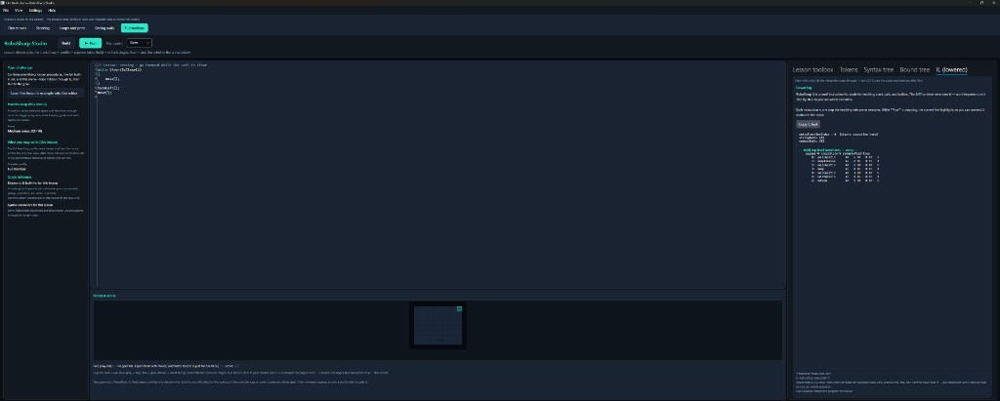
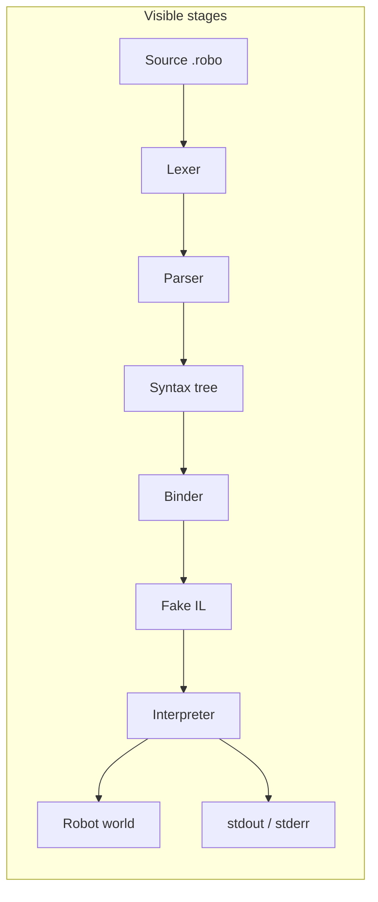

<p align="center">
  <a href="https://github.com/frankhaugen/RoboSharp/actions/workflows/ci.yml">
    
  </a>
  <a href="LICENSE">
    
  </a>
  
</p>

<h1 align="center">RoboSharp</h1>

<p align="center">
  <strong>See the compiler.</strong> A small C#-style language drives a robot on a grid — lexer, trees, binder, teaching IL, and interpreter are all visible in the tooling.
</p>

<p align="center">
  
</p>

<p align="center">
  <em>RoboSharp Studio — mission on the left, code in the middle, arena below, pipeline tabs on the right (tokens → syntax → bound tree → IL).</em>
</p>

---

## Why this exists

Most “learn to code” stacks hide the interesting parts. **RoboSharp** is the opposite: the product is a **teaching compiler and runtime** where the pipeline is the curriculum. You watch real stages update as you edit — not a cartoon of “magic happens here.”

- **Deterministic** stepping and snapshots — same inputs, same story.
- **Fake IL** you can read (not a dump of CLR bytecode).
- **Structured faults** instead of exception soup for normal failures.
- **Layered .NET solution** with architecture tests so the story stays honest.

---

## What you get

| | |
| --- | --- |
| **Language** | Lexer, parser, diagnostics, procedures, builtins (`move`, `print`, …) — [language overview](docs/language/language-overview.md) |
| **Compiler** | Binder, bound tree, lowering to teaching **IL** |
| **Runtime** | Interpreter, instruction stepping, stdout/stderr |
| **World** | Terrain, items, actors, movement, snapshots for any host |
| **Toolchain** | Compile to JSON **`.roboexe`**, workspace layout to `obj`/`bin` |
| **Hosts** | [Studio](docs/studio/README.md) (Avalonia IDE), [Player](docs/player/README.md) (CLI), [Web](docs/architecture/runtime-hosts.md) (Blazor) |

---

## The pipeline (nothing up our sleeve)



Specs: [compiler v1](docs/compiler/v1-compiler-spec.md) · [runtime v1](docs/runtime/v1-runtime-spec.md) · [toolchain v1](docs/toolchain/v1-toolchain-spec.md)

---

## Quick start

**Prerequisites:** [.NET SDK 10](https://dotnet.microsoft.com/download) per [`global.json`](global.json).

```powershell
git clone https://github.com/frankhaugen/RoboSharp.git
cd RoboSharp
dotnet restore RoboSharp.slnx
dotnet build RoboSharp.slnx
dotnet test RoboSharp.slnx
```

### RoboSharp Studio (desktop)

```powershell
dotnet run --project src/RoboSharp.Studio/RoboSharp.Studio.csproj
```

Build / Run, pick a lesson on the ribbon, and step through **Tokens**, **Syntax tree**, **Bound tree**, and **IL** in the inspector. Full notes: [`docs/build.md`](docs/build.md), [`docs/studio/README.md`](docs/studio/README.md).

### RoboSharp Player (CLI)

```powershell
dotnet run --project src/RoboSharp.Player/RoboSharp.Player.csproj -- samples/hello.roboexe
```

See [`samples/README.md`](samples/README.md) and [`docs/build.md`](docs/build.md#run-robosharp-player-compiled-roboexe-host).

---

## Repository layout

| Path | Role |
| --- | --- |
| [`src/`](docs/architecture/solution-structure.md) | `Language`, `Semantics`, `IL`, `Runtime`, `World`, `IO`, `Workspaces`, `Toolchain`, `Application`, `Hosting`, hosts |
| [`tests/`](docs/repository-layout.md) | **TUnit** + architecture guards |
| [`docs/`](docs/README.md) | Build, architecture, language, studio, gaps |
| [`samples/`](samples/README.md) | Teaching artifacts |
| [`AGENTS.md`](AGENTS.md) | Dependency rules & agent instructions (authoritative vs docs) |

Diagrams and `RoboSharp.slnx` refresh on commit when [`core.hooksPath`](docs/build.md) uses [`.githooks/`](.githooks/README.md).

---

## Design constraints

- **Inspectable** IR and runtime snapshots for UIs and tests.
- **Dependencies:** BCL, `Microsoft.Extensions.*`, **TUnit**, **Avalonia** only in `RoboSharp.Studio` — see [`AGENTS.md`](AGENTS.md), [`docs/nuget.md`](docs/nuget.md).

---

## Documentation

| | |
| --- | --- |
| **Index** | [`docs/README.md`](docs/README.md) |
| **Status / gaps** | [`docs/implementation-gaps.md`](docs/implementation-gaps.md) |
| **Mission** | [`docs/governance/mission.md`](docs/governance/mission.md) |

---

## License

[MIT](LICENSE)
