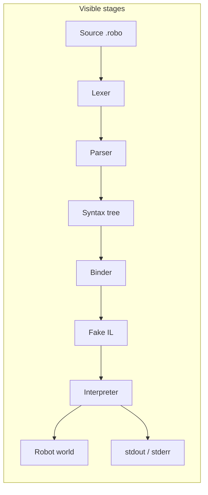

# RoboSharp

**RoboSharp** is a teaching compiler and runtime for a small C#-inspired language that drives a **robot on a grid**. Nothing important is hidden: you can follow source from **tokens → syntax tree → semantics → fake IL → interpreter → world and I/O** and inspect each stage in tooling.

The point is **clarity and observability**, not shipping a production language. Prefer reading the pipeline over guessing what the runtime did.

---

## At a glance

| | |
| --- | --- |
| **Language** | Lexer, parser, diagnostics, top-level statements (required program body), procedures, builtins (`move`, `print`, …) — see [language overview](docs/language/language-overview.md) |
| **Compiler** | Binder, bound tree, lowering to teaching **IL** (not CLR IL) |
| **Runtime** | Deterministic interpreter, structured faults, optional **instruction stepping** |
| **World** | `Terrain` / items / actors, movement, snapshots for hosts |
| **Toolchain** | In-memory compile, JSON **`.roboexe`**, workspace build to artifacts |
| **Hosts** | [Studio](docs/studio/README.md) (Avalonia IDE), [Player](docs/player/README.md) (CLI on `.roboexe`), [Web](docs/architecture/runtime-hosts.md) (Blazor Server smoke) |

---

## The pipeline



Normative contracts for compiler, runtime, and toolchain live under [`docs/compiler/v1-compiler-spec.md`](docs/compiler/v1-compiler-spec.md), [`docs/runtime/v1-runtime-spec.md`](docs/runtime/v1-runtime-spec.md), and [`docs/toolchain/v1-toolchain-spec.md`](docs/toolchain/v1-toolchain-spec.md).

---

## Quick start

**Prerequisites:** [.NET SDK 10](https://dotnet.microsoft.com/download) matching [`global.json`](global.json) (or compatible via `rollForward`).

```powershell
cd RoboSharp   # repository root after clone
dotnet restore RoboSharp.slnx
dotnet build RoboSharp.slnx
dotnet test RoboSharp.slnx
```

### RoboSharp Studio (desktop)

Code-first **Avalonia** shell: editor, Karel-style world, **Build** (compile-only) and **Run** (compile then step), pipeline panes (tokens, tree, diagnostics, bound tree, IL, world/runtime).

```powershell
dotnet run --project src/RoboSharp.Studio/RoboSharp.Studio.csproj
```

More detail: [`docs/build.md`](docs/build.md), [`docs/studio/README.md`](docs/studio/README.md).

### RoboSharp Player (CLI)

Runs a v1 **JSON** `.roboexe` with process exit codes. Handy for automation and “artifact only” demos.

```powershell
dotnet run --project src/RoboSharp.Player/RoboSharp.Player.csproj -- samples/hello.roboexe
```

Options (see `RoboSharp.Player --help`): `--max-steps <n>`, `--headless` (placeholder). Full notes: [`docs/build.md`](docs/build.md#run-robosharp-player-compiled-roboexe-host), [`samples/README.md`](samples/README.md).

---

## Repository layout

| Path | Role |
| --- | --- |
| [`src/`](docs/architecture/solution-structure.md) | Layered projects: `Language`, `Semantics`, `IL`, `Runtime`, `World`, `IO`, `Workspaces`, `Toolchain`, `Application`, `Hosting`, hosts (`Studio`, `Player`, `Web`) |
| [`tests/`](docs/repository-layout.md) | **TUnit** tests mirroring layers plus architecture guards |
| [`docs/`](docs/README.md) | Human docs: build, architecture, language, compiler, runtime, toolchain, studio, gaps |
| [`samples/`](samples/README.md) | Small teaching artifacts (e.g. `hello.roboexe`) |
| [`AGENTS.md`](AGENTS.md) | Architecture rules, dependency policy, agent instructions (**authoritative** vs docs) |

Generated Mermaid diagrams and solution layout refresh on commit when [`core.hooksPath`](docs/build.md) points at [`.githooks/`](.githooks/README.md).

---

## Design constraints

- **Deterministic** interpreter; normal failures are **results and faults**, not control-flow exceptions.
- **Inspectable** IR and snapshots for UIs and tests.
- **Dependencies:** .NET BCL, `Microsoft.Extensions.*`, **TUnit** for tests, **Avalonia** only inside `RoboSharp.Studio` (see [`AGENTS.md`](AGENTS.md) and [`docs/nuget.md`](docs/nuget.md)).

---

## Documentation and status

- **Index of all doc topics:** [`docs/README.md`](docs/README.md)
- **What is implemented vs still open:** [`docs/implementation-gaps.md`](docs/implementation-gaps.md), [`docs/missing-specs.md`](docs/missing-specs.md)
- **Mission and principles:** [`docs/governance/mission.md`](docs/governance/mission.md)

---

## License

[MIT](LICENSE)
