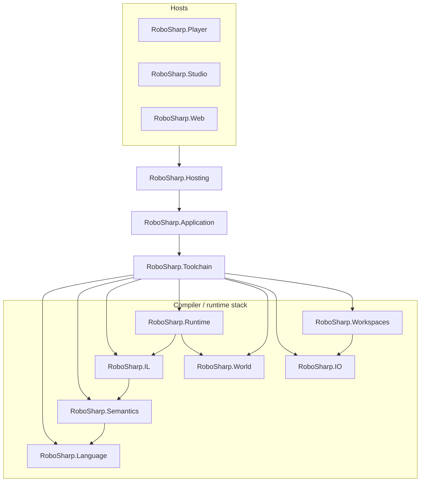

# Layer map (intent)

<!-- Generated by `.githooks/GenerateDocDiagrams.cs`. Do not edit by hand. -->

High-level dependency direction (hosts inward). This is a conceptual map, not an exact project graph.

