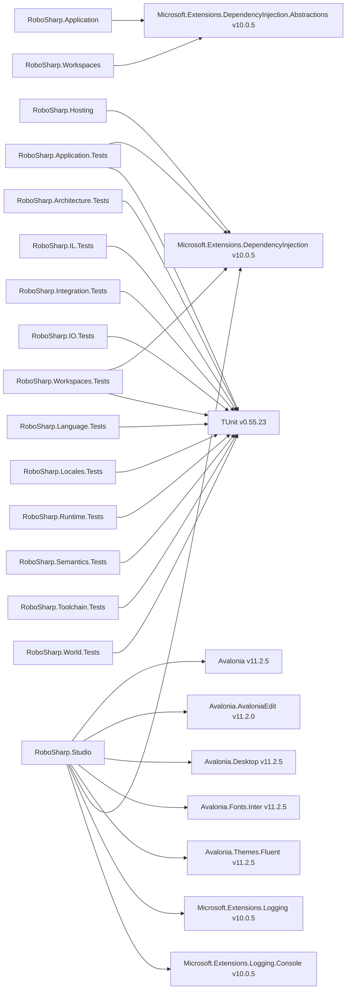

# NuGet package references

<!-- Generated by `.githooks/GenerateDocDiagrams.cs`. Do not edit by hand. -->

Direct `PackageReference` items per project, with versions from `Directory.Packages.props` where applicable.

