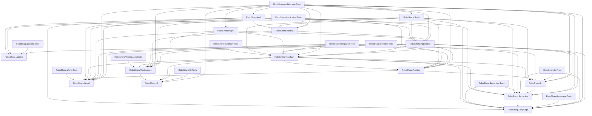

# Project reference graph

<!-- Generated by `.githooks/GenerateDocDiagrams.cs`. Do not edit by hand. -->

All `ProjectReference` edges between projects under `src/` and `tests/`.

```mermaid
flowchart TD
  RoboSharp_Application["RoboSharp.Application"] --> RoboSharp_IL["RoboSharp.IL"]
  RoboSharp_Application["RoboSharp.Application"] --> RoboSharp_Language["RoboSharp.Language"]
  RoboSharp_Application["RoboSharp.Application"] --> RoboSharp_Locales["RoboSharp.Locales"]
  RoboSharp_Application["RoboSharp.Application"] --> RoboSharp_Runtime["RoboSharp.Runtime"]
  RoboSharp_Application["RoboSharp.Application"] --> RoboSharp_Semantics["RoboSharp.Semantics"]
  RoboSharp_Application["RoboSharp.Application"] --> RoboSharp_Toolchain["RoboSharp.Toolchain"]
  RoboSharp_Application["RoboSharp.Application"] --> RoboSharp_Workspaces["RoboSharp.Workspaces"]
  RoboSharp_Application["RoboSharp.Application"] --> RoboSharp_World["RoboSharp.World"]
  RoboSharp_Application_Tests["RoboSharp.Application.Tests"] --> RoboSharp_Application["RoboSharp.Application"]
  RoboSharp_Application_Tests["RoboSharp.Application.Tests"] --> RoboSharp_Hosting["RoboSharp.Hosting"]
  RoboSharp_Application_Tests["RoboSharp.Application.Tests"] --> RoboSharp_Toolchain["RoboSharp.Toolchain"]
  RoboSharp_Application_Tests["RoboSharp.Application.Tests"] --> RoboSharp_Workspaces["RoboSharp.Workspaces"]
  RoboSharp_Application_Tests["RoboSharp.Application.Tests"] --> RoboSharp_World["RoboSharp.World"]
  RoboSharp_Architecture_Tests["RoboSharp.Architecture.Tests"] --> RoboSharp_Application["RoboSharp.Application"]
  RoboSharp_Architecture_Tests["RoboSharp.Architecture.Tests"] --> RoboSharp_Hosting["RoboSharp.Hosting"]
  RoboSharp_Architecture_Tests["RoboSharp.Architecture.Tests"] --> RoboSharp_IL["RoboSharp.IL"]
  RoboSharp_Architecture_Tests["RoboSharp.Architecture.Tests"] --> RoboSharp_IO["RoboSharp.IO"]
  RoboSharp_Architecture_Tests["RoboSharp.Architecture.Tests"] --> RoboSharp_Language["RoboSharp.Language"]
  RoboSharp_Architecture_Tests["RoboSharp.Architecture.Tests"] --> RoboSharp_Player["RoboSharp.Player"]
  RoboSharp_Architecture_Tests["RoboSharp.Architecture.Tests"] --> RoboSharp_Runtime["RoboSharp.Runtime"]
  RoboSharp_Architecture_Tests["RoboSharp.Architecture.Tests"] --> RoboSharp_Semantics["RoboSharp.Semantics"]
  RoboSharp_Architecture_Tests["RoboSharp.Architecture.Tests"] --> RoboSharp_Studio["RoboSharp.Studio"]
  RoboSharp_Architecture_Tests["RoboSharp.Architecture.Tests"] --> RoboSharp_Toolchain["RoboSharp.Toolchain"]
  RoboSharp_Architecture_Tests["RoboSharp.Architecture.Tests"] --> RoboSharp_Web["RoboSharp.Web"]
  RoboSharp_Architecture_Tests["RoboSharp.Architecture.Tests"] --> RoboSharp_Workspaces["RoboSharp.Workspaces"]
  RoboSharp_Architecture_Tests["RoboSharp.Architecture.Tests"] --> RoboSharp_World["RoboSharp.World"]
  RoboSharp_Hosting["RoboSharp.Hosting"] --> RoboSharp_Application["RoboSharp.Application"]
  RoboSharp_Hosting["RoboSharp.Hosting"] --> RoboSharp_Workspaces["RoboSharp.Workspaces"]
  RoboSharp_IL["RoboSharp.IL"] --> RoboSharp_Semantics["RoboSharp.Semantics"]
  RoboSharp_IL_Tests["RoboSharp.IL.Tests"] --> RoboSharp_IL["RoboSharp.IL"]
  RoboSharp_IL_Tests["RoboSharp.IL.Tests"] --> RoboSharp_Language["RoboSharp.Language"]
  RoboSharp_IL_Tests["RoboSharp.IL.Tests"] --> RoboSharp_Semantics["RoboSharp.Semantics"]
  RoboSharp_Integration_Tests["RoboSharp.Integration.Tests"] --> RoboSharp_IL["RoboSharp.IL"]
  RoboSharp_Integration_Tests["RoboSharp.Integration.Tests"] --> RoboSharp_Runtime["RoboSharp.Runtime"]
  RoboSharp_Integration_Tests["RoboSharp.Integration.Tests"] --> RoboSharp_Semantics["RoboSharp.Semantics"]
  RoboSharp_Integration_Tests["RoboSharp.Integration.Tests"] --> RoboSharp_Toolchain["RoboSharp.Toolchain"]
  RoboSharp_Integration_Tests["RoboSharp.Integration.Tests"] --> RoboSharp_Workspaces["RoboSharp.Workspaces"]
  RoboSharp_Integration_Tests["RoboSharp.Integration.Tests"] --> RoboSharp_World["RoboSharp.World"]
  RoboSharp_IO_Tests["RoboSharp.IO.Tests"] --> RoboSharp_IO["RoboSharp.IO"]
  RoboSharp_Language_Tests["RoboSharp.Language.Tests"] --> RoboSharp_Language["RoboSharp.Language"]
  RoboSharp_Locales_Tests["RoboSharp.Locales.Tests"] --> RoboSharp_Locales["RoboSharp.Locales"]
  RoboSharp_Player["RoboSharp.Player"] --> RoboSharp_Application["RoboSharp.Application"]
  RoboSharp_Player["RoboSharp.Player"] --> RoboSharp_IO["RoboSharp.IO"]
  RoboSharp_Player["RoboSharp.Player"] --> RoboSharp_Toolchain["RoboSharp.Toolchain"]
  RoboSharp_Player["RoboSharp.Player"] --> RoboSharp_World["RoboSharp.World"]
  RoboSharp_Runtime["RoboSharp.Runtime"] --> RoboSharp_IL["RoboSharp.IL"]
  RoboSharp_Runtime["RoboSharp.Runtime"] --> RoboSharp_World["RoboSharp.World"]
  RoboSharp_Runtime_Tests["RoboSharp.Runtime.Tests"] --> RoboSharp_Runtime["RoboSharp.Runtime"]
  RoboSharp_Runtime_Tests["RoboSharp.Runtime.Tests"] --> RoboSharp_Toolchain["RoboSharp.Toolchain"]
  RoboSharp_Semantics["RoboSharp.Semantics"] --> RoboSharp_Language["RoboSharp.Language"]
  RoboSharp_Semantics_Tests["RoboSharp.Semantics.Tests"] --> RoboSharp_Language["RoboSharp.Language"]
  RoboSharp_Semantics_Tests["RoboSharp.Semantics.Tests"] --> RoboSharp_Semantics["RoboSharp.Semantics"]
  RoboSharp_Studio["RoboSharp.Studio"] --> RoboSharp_Application["RoboSharp.Application"]
  RoboSharp_Studio["RoboSharp.Studio"] --> RoboSharp_Hosting["RoboSharp.Hosting"]
  RoboSharp_Studio["RoboSharp.Studio"] --> RoboSharp_IL["RoboSharp.IL"]
  RoboSharp_Studio["RoboSharp.Studio"] --> RoboSharp_Language["RoboSharp.Language"]
  RoboSharp_Studio["RoboSharp.Studio"] --> RoboSharp_Locales["RoboSharp.Locales"]
  RoboSharp_Studio["RoboSharp.Studio"] --> RoboSharp_Runtime["RoboSharp.Runtime"]
  RoboSharp_Studio["RoboSharp.Studio"] --> RoboSharp_Semantics["RoboSharp.Semantics"]
  RoboSharp_Studio["RoboSharp.Studio"] --> RoboSharp_Toolchain["RoboSharp.Toolchain"]
  RoboSharp_Studio["RoboSharp.Studio"] --> RoboSharp_World["RoboSharp.World"]
  RoboSharp_Toolchain["RoboSharp.Toolchain"] --> RoboSharp_IL["RoboSharp.IL"]
  RoboSharp_Toolchain["RoboSharp.Toolchain"] --> RoboSharp_IO["RoboSharp.IO"]
  RoboSharp_Toolchain["RoboSharp.Toolchain"] --> RoboSharp_Language["RoboSharp.Language"]
  RoboSharp_Toolchain["RoboSharp.Toolchain"] --> RoboSharp_Runtime["RoboSharp.Runtime"]
  RoboSharp_Toolchain["RoboSharp.Toolchain"] --> RoboSharp_Semantics["RoboSharp.Semantics"]
  RoboSharp_Toolchain["RoboSharp.Toolchain"] --> RoboSharp_Workspaces["RoboSharp.Workspaces"]
  RoboSharp_Toolchain["RoboSharp.Toolchain"] --> RoboSharp_World["RoboSharp.World"]
  RoboSharp_Toolchain_Tests["RoboSharp.Toolchain.Tests"] --> RoboSharp_Toolchain["RoboSharp.Toolchain"]
  RoboSharp_Web["RoboSharp.Web"] --> RoboSharp_Application["RoboSharp.Application"]
  RoboSharp_Web["RoboSharp.Web"] --> RoboSharp_Hosting["RoboSharp.Hosting"]
  RoboSharp_Web["RoboSharp.Web"] --> RoboSharp_Language["RoboSharp.Language"]
  RoboSharp_Web["RoboSharp.Web"] --> RoboSharp_Locales["RoboSharp.Locales"]
  RoboSharp_Web["RoboSharp.Web"] --> RoboSharp_Semantics["RoboSharp.Semantics"]
  RoboSharp_Web["RoboSharp.Web"] --> RoboSharp_World["RoboSharp.World"]
  RoboSharp_Workspaces["RoboSharp.Workspaces"] --> RoboSharp_IO["RoboSharp.IO"]
  RoboSharp_Workspaces_Tests["RoboSharp.Workspaces.Tests"] --> RoboSharp_Workspaces["RoboSharp.Workspaces"]
  RoboSharp_World_Tests["RoboSharp.World.Tests"] --> RoboSharp_World["RoboSharp.World"]
```

